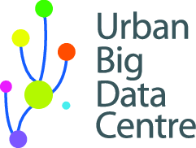

# Video Analytics Project

The Video Analytics Project is a repository with the all the code (except code with sensitive data) which is currently running in experimental mode at Glasgow City Council.

This project is being developed by UBDC in partnership with Glasgow City Council.

The following directories must be created:

| Directory | Description |
|-----------|-------------|
| archive_folder | to save processed videos
| input_folder | to place videos to be processed by tf_serving
| logs/capture | to place logs regarding capture of videos
| logs/scaling | to place logs regarding scaling of videos
| logs/tf_serving | to place logs regarding tf_serving processing 
| output_folder | to place processed videos with bounding boxes and database
| staging_area/capture | to place raw videos collected from cctv cameras
| staging_area/scaling | to scale videos before being moved to the input_folder
